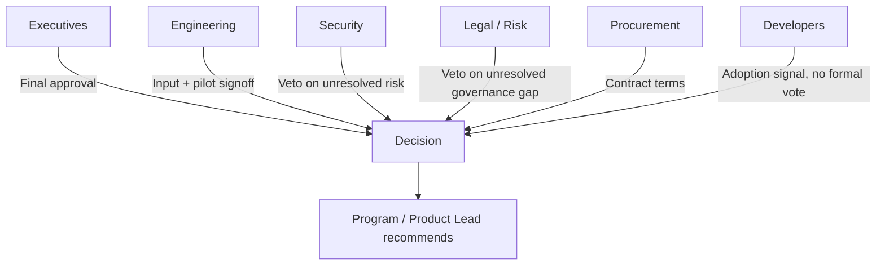

# Stakeholder Map

## Stakeholders and Their Stake

| Stakeholder | Primary Concern | Decision Right |
|---|---|---|
| Executives | ROI, strategic alignment, competitive positioning | Final approval on enterprise-scale investment |
| Engineering leadership | Developer productivity, tool quality, adoption | Input on developer-experience and integration criteria; pilot sign-off |
| Security | Data handling, code exposure, vendor security posture | Veto on unresolved High-risk security findings |
| Legal / Risk | Regulatory exposure, vendor contract terms, governance | Veto on unresolved governance gaps before enterprise rollout |
| Procurement | Contract terms, vendor dependency, pricing structure | Contract negotiation and vendor terms |
| Developers | Day-to-day usability, workflow fit | No formal decision right, but adoption depends entirely on their buy-in |
| Program / Product (this role) | Runs the evaluation process, owns the recommendation | Owns the decision framework and the recommendation; does not unilaterally decide |

## Engagement Approach

## Why Developers Have No Formal Decision Right but Still Drive the Outcome

Formal decision rights sit with the groups accountable for risk, budget, and strategy. But the [Weighting Rationale](../evaluation-criteria/weighting.md) puts developer experience at the top specifically because a tool the people accountable for it can veto but that developers won't use is still a failed decision in practice. The stakeholder map and the weighting model are designed to reinforce each other on this point.
